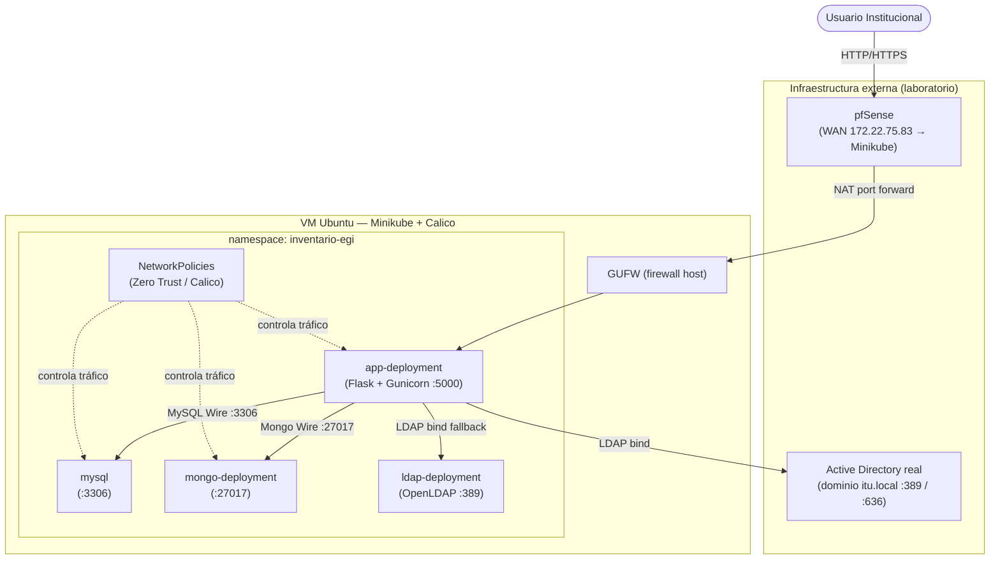

<div align="center">

# EGI — Ecosistema de Gestión de Inventario

**Proyecto Integrador · EGI · ITU UNCUYO**

Sistema centralizado para inventariar equipos de los laboratorios de informática del ITU, con despliegue contenerizado en Kubernetes, políticas de red Zero-Trust y autenticación institucional vía Active Directory / LDAP.

<br/>

[](https://flask.palletsprojects.com/)
[](https://www.python.org/)
[](https://kubernetes.io/)
[](https://www.docker.com/)
[](https://www.mongodb.com/)
[](https://www.mysql.com/)
[](https://www.openldap.org/)

</div>

---

## Descripción

Sistema web que permite inventariar y gestionar los equipos de los laboratorios del ITU. Combina datos relacionales de ubicación y responsables (MySQL) con especificaciones de hardware (MongoDB) en una API REST Flask, desplegada sobre Kubernetes con autenticación LDAP/JWT y políticas de red Zero-Trust aplicadas mediante Calico CNI.

El tráfico entrante atraviesa un firewall perimetral pfSense antes de llegar al clúster. Un runner self-hosted de GitHub Actions automatiza build y deploy en la misma VM del laboratorio.

---

## Arquitectura

Arquitectura distribuida con **4 componentes principales**: pfSense (perímetro), Active Directory real externo (autenticación), SQL Server / MySQL (datos relacionales) y Kubernetes/Minikube en Ubuntu (aplicación contenerizada).



| Componente | Ubicación | Rol | Puerto |
|------------|-----------|-----|--------|
| pfSense | Externo (laboratorio) | Firewall perimetral y gateway | 172.22.75.83 → :30080 |
| Active Directory | Externo (Windows) | Autenticación institucional real | 389 / 636 |
| GUFW | Host Ubuntu (VM) | Firewall del sistema operativo anfitrión | — |
| `app-deployment` (Flask) | K8s `inventario-egi` | API REST + sirve el frontend | 5000 → NodePort 30080 |
| `mysql` | K8s `inventario-egi` | Datos relacionales: equipos, laboratorios, responsables | 3306 |
| `mongo-deployment` | K8s `inventario-egi` | Especificaciones de hardware (documentos) | 27017 |
| `ldap-deployment` (OpenLDAP) | K8s `inventario-egi` | Respaldo LDAP interno | 389 / 636 |

---

## Stack tecnológico

| Capa | Tecnologías |
|------|-------------|
| **Backend** | Flask 3.x, Gunicorn, Python 3.11 |
| **Frontend** | HTML5, CSS3, JavaScript vanilla (multi-página) |
| **Datos relacionales** | MySQL 8.x (dentro del clúster) — SQL Server externo (AD Windows, datos reales) |
| **Datos documentales** | MongoDB (contenerizado en K8s, colección `hardware`) |
| **Identidad** | Active Directory real (`itu.local`) + OpenLDAP interno de respaldo; JWT (PyJWT, HS256, 8 h) |
| **Infraestructura** | Docker, Kubernetes (Minikube), Calico CNI |
| **Seguridad** | NetworkPolicies (Calico), pfSense (firewall perimetral), GUFW |
| **CI/CD** | GitHub Actions (self-hosted runner en la VM del laboratorio) |

---

## Estructura del repositorio

```
MATE-ProyectoEGI/
├── app.py                          # Flask backend (API REST completa)
├── Dockerfile                      # Python 3.11-slim + Gunicorn
├── requirements.txt                # Flask, Gunicorn, PyMySQL, pymongo, ldap3, PyJWT
├── limpieza.sh                     # Verificación completa pre-defensa (8 pasos con colores)
├── frontend/                       # HTML/CSS/JS vanilla (multi-página)
│   ├── login.html                  # Pantalla de login
│   ├── index.html                  # Dashboard principal
│   ├── detalle.html                # Vista de detalle de equipo
│   ├── control.html                # Panel de control
│   ├── reportes.html               # Reportes
│   ├── css/                        # base.css, variables.css, dashboard.css, etc.
│   ├── js/                         # login.js, dashboard.js, detalle.js, etc.
│   └── assets/                     # logo-itu.svg, thumbnails por tipo de equipo
├── db/
│   ├── sql/
│   │   ├── schema.sql              # Esquema MySQL: AULAS, LABORATORIOS, RESPONSABLES, EQUIPOS, MANTENIMIENTOS
│   │   └── datos_prueba.sql        # Datos de prueba
│   └── mongo/
│       ├── seed.json               # Documentos de hardware de ejemplo
│       └── queries_demo.md         # Queries CRUD y aggregation para la demo
├── k8s/
│   ├── namespace/namespace.yaml    # namespace inventario-egi
│   ├── configmaps/                 # app-config, ldap-config, mongo-config, mysql-config
│   ├── secrets/                    # gitignored — recrear manualmente en cada VM
│   ├── deployments/                # app-deployment, mysql, mongo-deployment, ldap-deployment
│   ├── services/                   # app-service (NodePort 30080), mysql, mongo, ldap
│   ├── pvc/                        # ldap-pvc, mongo-pvc, mysql-pvc
│   └── networkpolicies/            # 01-deny-all + 02/03/04 allow rules (Zero Trust)
├── imagenes-constancia/            # Capturas de pantalla (CI/CD, permisos SQL)
├── .github/workflows/deploy.yml    # Pipeline GitHub Actions (self-hosted runner)
└── docs/                           # Informe formal, diagramas
```

---

## Requisitos previos

- Python 3.11+ (solo para desarrollo local sin Docker)
- Docker + Minikube (`minikube start --cni=calico`) y kubectl
- Ubuntu 22.04 con **Adaptador Puente** (misma red física que pfSense — *no* WSL2, que usa NAT virtual aislada)
- Acceso de red a la IP WAN de pfSense (verificar con `ip a`)

> **Nota**: Minikube **debe** iniciarse con `--cni=calico`. Agregarlo después no tiene efecto — sin Calico, las NetworkPolicies se crean pero no bloquean nada realmente.

---

## Inicio rápido (primera vez en una VM nueva)

```bash
# 1. Clonar el repositorio y ubicarse en la rama de entrega
git clone https://github.com/ZogeGBR/MATE-ProyectoEGI.git
cd MATE-ProyectoEGI
git checkout EGI-Final

# 2. Iniciar Minikube con Calico (OBLIGATORIO el flag --cni=calico)
minikube start --driver=docker --cni=calico --memory=4096 --cpus=2

# 3. Buildear la imagen dentro del daemon Docker de Minikube
eval $(minikube docker-env)
docker build -t inventario-app:latest .

# 4. Crear el namespace
kubectl apply -f k8s/namespace/namespace.yaml

# 5. Crear los Secrets (nunca están en el repo — recrear en cada VM nueva)
kubectl create secret generic mysql-secret \
  --from-literal=MYSQL_ROOT_PASSWORD=RootPass2024! \
  --from-literal=MYSQL_USER=app_user \
  --from-literal=MYSQL_PASSWORD=AppPass2024! \
  --from-literal=MYSQL_DATABASE=inventario_itu \
  -n inventario-egi

kubectl create secret generic mongo-secret \
  --from-literal=MONGO_INITDB_ROOT_USERNAME=mongo_admin \
  --from-literal=MONGO_INITDB_ROOT_PASSWORD=MongoPass2024! \
  -n inventario-egi

kubectl create secret generic ldap-secret \
  --from-literal=LDAP_ADMIN_USERNAME=admin \
  --from-literal=LDAP_ADMIN_PASSWORD=LdapAdmin2024! \
  -n inventario-egi

kubectl create secret generic app-secret \
  --from-literal=MYSQL_PASSWORD=AppPass2024! \
  --from-literal=MONGO_PASSWORD=MongoPass2024! \
  --from-literal=LDAP_BIND_PASSWORD=LdapAdmin2024! \
  --from-literal=JWT_SECRET_KEY='JwtSuperSecretEGI2024!!' \
  -n inventario-egi

# 6. Aplicar el resto de manifiestos en orden
kubectl apply -f k8s/pvc/
kubectl apply -f k8s/configmaps/
kubectl apply -f k8s/deployments/
kubectl apply -f k8s/services/
kubectl apply -f k8s/networkpolicies/

# 7. Verificar que los 4 pods están Running
kubectl get pods -n inventario-egi

# 8. Acceder a la app (port-forward temporal)
kubectl port-forward -n inventario-egi svc/inventario-app-service 8080:5000
# Abrir: http://localhost:8080
```

> ⚠️ Si algún pod (`ldap` o `mongo`) queda en `Pending`, verificar PVCs: `kubectl get pvc -n inventario-egi` y reaplicar `k8s/pvc/`.

---

## Despliegue con Docker

La imagen de la app se construye dentro del daemon Docker de Minikube para que sea visible al clúster sin necesidad de un registry externo.

```bash
# Apuntar Docker al daemon de Minikube
eval $(minikube docker-env)

# Construir la imagen (Python 3.11-slim + Gunicorn)
docker build -t inventario-app:latest .

# Verificar que la imagen existe en Minikube
docker images | grep inventario-app
```

| Imagen | Origen | Puerto |
|--------|--------|--------|
| `inventario-app:latest` | `Dockerfile` (Python 3.11-slim + Gunicorn) | 5000 |
| `mongo` | Docker Hub | 27017 |
| `mysql:8` | Docker Hub | 3306 |
| `osixia/openldap` | Docker Hub | 389 / 636 |

> **`imagePullPolicy: Never`** en `app-deployment.yaml` — la imagen nunca se busca en un registry, siempre se usa la local cargada en Minikube.

---

## Despliegue en Kubernetes (Minikube + Calico)

### Topología de red

```
Internet / WiFi laboratorio
        │
    pfSense (WAN 172.22.75.83 → LAN/SERVER 192.168.1.254)
        │                                  │
    GUFW (host Ubuntu)          AD Windows (192.168.1.10:389)
        │
  Minikube + Calico
  namespace: inventario-egi
        │
  app-deployment (Flask) ──┬──▶ AD/SQL Server reales (vía pfSense)
                            ├──▶ mongo-deployment (interno, K8s :27017)
                            ├──▶ mysql (interno, K8s :3306)
                            └──▶ ldap-deployment (interno, K8s :389)
```

### Manifiestos aplicados

```bash
# Orden recomendado
kubectl apply -f k8s/namespace/namespace.yaml
kubectl apply -f k8s/pvc/
kubectl apply -f k8s/configmaps/
kubectl apply -f k8s/deployments/
kubectl apply -f k8s/services/
# NetworkPolicies AL FINAL (evita que deny-all bloquee el arranque inicial)
kubectl apply -f k8s/networkpolicies/
```

### Endpoints de la API

| Método | Ruta | Descripción | Auth |
|--------|------|-------------|------|
| GET | `/api/health` | Estado de conexión a MySQL, MongoDB y LDAP | ✗ |
| POST | `/api/login` | Autenticar contra LDAP → devuelve JWT | ✗ |
| POST | `/api/logout` | Logout (stateless — limpia del lado cliente) | ✗ |
| GET | `/api/equipos` | Listar todos los equipos (MySQL JOIN) | ✓ JWT |
| GET | `/api/equipos/<mongo_id>` | Detalle de hardware (MongoDB) | ✓ JWT |
| POST | `/api/equipos` | Crear equipo (MongoDB + MySQL) | ✓ JWT |
| PUT | `/api/equipos/<mongo_id>` | Editar equipo (MongoDB + MySQL) | ✓ JWT |
| DELETE | `/api/equipos/<mongo_id>` | Eliminar equipo (MySQL + MongoDB) | ✓ JWT |
| GET | `/api/laboratorios` | Listar laboratorios | ✓ JWT |
| GET | `/api/responsables` | Listar responsables | ✓ JWT |

---

## NetworkPolicies — Zero Trust

El namespace `inventario-egi` aplica **4 NetworkPolicies** con Calico CNI para garantizar aislamiento total entre pods.

| Política | Archivo | Efecto |
|----------|---------|--------|
| `deny-all` | `01-deny-all.yaml` | Bloquea todo ingress y egress por defecto (base Zero Trust) |
| `allow-app-to-databases` | `02-allow-app-to-databases.yaml` | Solo `inventario-app` puede conectar a `mysql:3306`, `mongo:27017`, `ldap:389/636` |
| `allow-app-egress` | `03-allow-app-egress.yaml` | Permite egress de `inventario-app` hacia el exterior (pfSense, AD real) |
| `allow-external-to-app` | `04-allow-external-to-app.yaml` | Permite ingress externo al puerto 5000 de `inventario-app` |

```bash
# Verificar que las políticas están aplicadas
kubectl get networkpolicies -n inventario-egi

# Probar aislamiento — el pod de MongoDB NO debe poder salir a internet
kubectl run test-deny --image=busybox:1.28 --restart=Never -n inventario-egi -- sleep 3600
kubectl exec -it test-deny -n inventario-egi -- nc -zv mongo-service 27017  # DEBE CONECTAR
kubectl exec -it test-deny -n inventario-egi -- nc -zv 8.8.8.8 53           # DEBE FALLAR
kubectl delete pod test-deny -n inventario-egi
```

> ⚠️ Sin `--cni=calico` en `minikube start`, las NetworkPolicies se crean pero **no tienen efecto real**. Calico es el único que las enforcea en Minikube.

---

## CI/CD — GitHub Actions (self-hosted)

El workflow `.github/workflows/deploy.yml` se dispara con cada push a `main` o `EGI-Final` y corre en un **runner self-hosted** instalado en la VM del laboratorio (un runner cloud no vería el clúster ni la red `172.22.x.x`).

### Pasos del pipeline

1. **Checkout** del código
2. **Verificación** de conectividad al clúster (`kubectl cluster-info`)
3. **Build** de la imagen dentro del daemon Docker de Minikube (`eval $(minikube docker-env)`)
4. **Crear namespace** (idempotente, `kubectl apply`)
5. **Crear/actualizar Secrets** desde GitHub Secrets (nunca en texto plano en el repo)
6. **Aplicar PVCs, ConfigMaps, Deployments, Services**
7. **Esperar rollout** de los 4 deployments (`kubectl rollout status --timeout=120s`)
8. **Aplicar NetworkPolicies** (al final, para no bloquear el arranque)
9. **Estado final** del clúster (`pods`, `services`, `networkpolicies`, URL de la app)
10. **Health check** informativo de `/api/health`

### Secrets de GitHub (Settings → Secrets and variables → Actions)

| Secret | Descripción |
|--------|-------------|
| `MYSQL_ROOT_PASSWORD` | Contraseña root de MySQL |
| `MYSQL_PASSWORD` | Contraseña del usuario `app_user` |
| `MONGO_ROOT_PASSWORD` | Contraseña de `mongo_admin` |
| `LDAP_ADMIN_PASSWORD` | Contraseña del admin de OpenLDAP |
| `JWT_SECRET_KEY` | Clave para firmar tokens JWT (mínimo 32 caracteres) |

> Los secrets se crean con `--dry-run=client -o yaml | kubectl apply -f -` para ser idempotentes (actualizan si ya existen).

---

## Flujo de arranque del entorno

Para levantar el sistema desde cero en la VM del laboratorio:

1. **Iniciar Minikube** (si no está corriendo):
   ```bash
   minikube start --driver=docker --cni=calico --memory=4096 --cpus=2
   ```

2. **Verificar que los 4 pods están Running**:
   ```bash
   kubectl get pods -n inventario-egi
   ```
   Esperado: `app-deployment`, `mysql`, `mongo-deployment`, `ldap-deployment` en `Running`.

3. **Verificar conectividad hacia pfSense** (Active Directory y SQL Server reales):
   ```bash
   nc -zv 172.22.75.83 389    # Active Directory
   nc -zv 172.22.75.83 3306   # SQL Server
   ```

4. **Exponer la app** (port-forward temporal para testing local):
   ```bash
   kubectl port-forward -n inventario-egi svc/inventario-app-service 8080:5000
   ```

5. **Verificar health check**:
   ```bash
   curl http://localhost:8080/api/health
   # Esperado: {"status":"ok","services":{"sql":"connected","mongo":"connected","ldap":"connected"}}
   ```

6. **Acceder al frontend**: `http://localhost:8080`

### Verificación completa pre-defensa

El script `limpieza.sh` automatiza 8 pasos de verificación con salida en colores:

```bash
bash limpieza.sh
# Verifica: Minikube, Calico, pods, NetworkPolicies, GUFW, y test E2E de /api/health y login
```

---

## Acceso externo (desde otra computadora en la misma red)

El tráfico externo entra por pfSense (WAN `172.22.75.83`) y llega al pod Flask vía NAT.

**En la máquina del profesor o evaluador** (solo la primera vez):
```bash
# Linux/Mac
echo "172.22.75.83 inventario.itu.local" | sudo tee -a /etc/hosts

# Windows (PowerShell como admin)
Add-Content -Path "C:\Windows\System32\drivers\etc\hosts" -Value "172.22.75.83 inventario.itu.local"
```

Luego acceder en el browser:
```
http://inventario.itu.local:30080
```

> **Nota**: la IP WAN de pfSense puede cambiar si el WiFi del laboratorio reasigna DHCP. Verificar en `Status → Interfaces` en pfSense y actualizar `/etc/hosts` si es necesario.

### Usuarios disponibles para demo

| Usuario | Contraseña | Dominio | Rol |
|---------|-----------|---------|-----|
| `docente01` | `Itu12345!` | `itu.local` | docente |
| `admin01` | `Itu12345!` | `itu.local` | tecnico |
| (alumno) | `Itu12345!` | `itu.local` | alumno |

> Los roles se asignan en la API según el prefijo del `uid`: `admin*` → tecnico, `docente*` → docente, resto → alumno.

---

## Comandos útiles para la demo

```bash
# Estado general del clúster
kubectl get pods -n inventario-egi
kubectl get networkpolicies -n inventario-egi
kubectl get svc -n inventario-egi

# Logs de la app (útil para debug de login LDAP)
kubectl logs -n inventario-egi -l app=inventario-app --tail=50

# Shell de MongoDB para queries en vivo (CRUD)
MONGO_POD=$(kubectl get pod -n inventario-egi -l app=mongo -o jsonpath='{.items[0].metadata.name}')
kubectl exec -it -n inventario-egi $MONGO_POD -- \
  mongosh -u mongo_admin -p MongoPass2024! --authenticationDatabase admin inventario_itu

# Reiniciar la app (rollout limpio — preferir sobre borrar pods)
kubectl rollout restart deployment/app-deployment -n inventario-egi

# Cargar seed de MongoDB (si la colección hardware está vacía)
kubectl cp db/mongo/seed.json inventario-egi/$MONGO_POD:/tmp/seed.json
kubectl exec -n inventario-egi $MONGO_POD -- mongoimport \
  -u mongo_admin -p MongoPass2024! \
  --authenticationDatabase admin \
  --db inventario_itu --collection hardware \
  --file /tmp/seed.json --jsonArray

# Estado de GUFW (firewall del host Ubuntu)
sudo ufw status verbose

# Probar aislamiento Zero Trust (debe FALLAR)
kubectl run test-deny --image=busybox:1.28 --restart=Never -n inventario-egi -- sleep 3600
kubectl exec -it test-deny -n inventario-egi -- nc -zv mysql-service 3306  # DEBE FALLAR desde test-deny
kubectl delete pod test-deny -n inventario-egi
```

---

## Notas de mantenimiento

- **No commitear `k8s/secrets/`**: esos archivos solo deben existir localmente en cada VM, nunca en el repo (están en `.gitignore`).
- **IP de pfSense puede cambiar** si el WiFi reasigna DHCP. Si `/api/health` reporta `sql` o `ldap` en `error`, verificar `Status → Interfaces` en pfSense y actualizar `k8s/configmaps/app-config.yaml`.
- **Preferir `kubectl rollout restart`** sobre `kubectl delete pod` para evitar ReplicaSets huérfanos acumulados.
- **El runner self-hosted** de GitHub Actions debe estar activo en la VM para que el pipeline CI/CD funcione. Verificar en la pestaña **Actions** del repositorio.

---

## Equipo

| Integrante | Rol principal |
|------------|---------------|
| Integrante 1 | NetworkPolicies Zero Trust, GUFW, infraestructura Linux |
| Integrante 2 | Modelo de base de datos MySQL (schema, datos de prueba) |
| Integrante 3 | Frontend HTML/CSS/JS (dashboard, detalle, reportes) |
| Integrante 4 | ConfigMaps, Secrets, deployments K8s, integración CI/CD |
| Integrante 5 | Backend Flask (app.py), autenticación JWT+LDAP, API REST |

---

## Entregables

- [x] Esquema de arquitectura (servicios, puertos, reglas de red, topología pfSense)
- [x] Modelo y scripts de base de datos (MySQL schema + MongoDB seed)
- [x] Aplicación web funcional (Flask + HTML/JS vanilla)
- [x] Manifiestos Kubernetes y NetworkPolicies Zero Trust
- [x] Ecosistema funcional en Minikube + pfSense
- [x] Pipeline CI/CD con GitHub Actions (self-hosted runner)
- [x] Script de verificación pre-defensa (`limpieza.sh`)
- [x] Documentación completa (README + LEEME + informe formal)
- [x] Repositorio Git con historial de evolución (rama `EGI-Final`)

---

## Documentación

| Recurso | Descripción |
|---------|-------------|
| [`README.md`](./README.md) | Este archivo: descripción, arquitectura, stack y despliegue |
| [`LEEME.md`](./LEEME.md) | Guía de instalación paso a paso, comandos de la demo y notas de mantenimiento |
| [`db/sql/schema.sql`](./db/sql/schema.sql) | DDL completo: tablas AULAS, LABORATORIOS, RESPONSABLES, EQUIPOS, MANTENIMIENTOS |
| [`db/mongo/queries_demo.md`](./db/mongo/queries_demo.md) | Queries CRUD y aggregation de MongoDB para la demo |
| [`k8s/networkpolicies/`](./k8s/networkpolicies/) | Manifiestos de NetworkPolicies (Zero Trust: deny-all + 3 allow rules) |
| [`.github/workflows/deploy.yml`](./.github/workflows/deploy.yml) | Pipeline CI/CD: build, deploy y health check automatizados |
| `docs/` | Informe formal del proyecto, diagramas de topología y modelo de datos |

---

## Licencia

Proyecto académico — Instituto Tecnológico Universitario (ITU), UNCUYO, Mendoza, 2024–2025.

---

<div align="center">

**ITU · UNCUYO · EGI · 2025**

</div>
